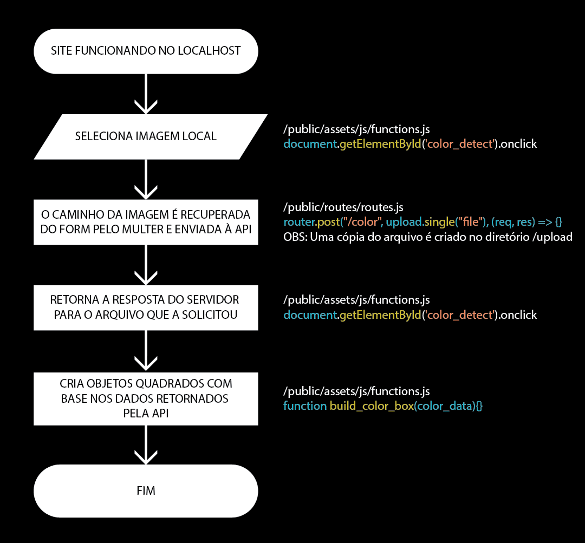

# _Sprint 3: Cloud Foundation (AWS), Linux e Docker_
## _Execução em docker do projeto da Sprint 2, dentro da AWS Cloud_

O projeto consiste no uso da API Vision AI do Cloud Vision a qual uma foto é enviada e o servidor responde as 10 cores principais da imagem.

## Sumário
- Como usar;
- Diagrama simplificado de funcionamento;
- Processo de desenvolvimento;
- Dificuldades encontradas.

## Como usar:
_OBS: Necessário ter conhecimento prévio básico de docker_
Antes de se assustar com o tamanho das instruções saiba que a maior parte delas tem por objetivo a criação de uma chave de uma conta de serviço em JSON. Se já sabe fazer isso ou já tem uma, pode pular para a parte "AQUI---------------".

Para usar esse projeto é necessário criar uma conta no Google Cloud. Apoós logar na sua conta, vá para o console (clique no ícone do Google Cloud no canto superior esquerdo ou no botão console no canto superior direito). Uma vez dentro do console, é necessário criar um novo projeto. Para tal, clique no botão logo à esquerda da barra de pesquisa (Se a conta for nova o botão irá conter o nome "My First Project") e selecionar "Novo Projeto" no menu flutuante que é aberto. Na nova página escolha um nome qualquer para colocar no campo "Nome do Projeto" e clique em "Criar". Aguarde o Cloud terminar de criar o projeto e selecione ele no mesmo menu flutuante em que está a opção "Novo Projeto". Agora você deve estar no console e o nome do seu novo projeto deve estar ao lado da caixa de pesquisa do Cloud.

Com tudo certo até aqui, clique nas 3 barras no canto superior esquerdo para abrir um menu lateral. Posicione o cursor do mouse sobre a opção "APIs e Serviços" e clique na opção "Credenciais" que é exibida em um menu flutuante. Na nova página procure a opção "+ CRIAR CREDENCIAIS" e selecione "Conta de serviço". Agora escolha um texto para colocar no campo "ID da conta de serviço" e clique em "Concluir" no final da página (Pulando todos os campos de preenchimento opicional). Agora você deve estar de volta na página de credenciais na qual clicou em "+ CRIAR CREDENCIAIS".

No final dessa página, na seção Contas de serviço agora aparece a que você acaba de criar. Clique no texto "[ID_ESCOLHIDO]@[NOME DO PROJETO].iam.gserviceaccount.com", procure a aba "CHAVES" e na opção "ADICINOAR CHAVE" escolha "Criar nova chave" e com a opção "JSON" selecionada, clique em "CRIAR".

_OBS: Do mesmo você usará o arquivo que acaba de ser baixado em seu computador para acessar o Google Cloud, outras pessoas podem o fazer em seu nome, então NÃO COMPARTILHE ESSE ARQUIVO COM MAIS NINGUÉM._

AQUI---------------

Agora é só baixar esse projeto, copiar sua credencial para a pasta raiz e renomeá-lo para "credential", usar o docker para construir uma imagem e executá-la em um container (a porta do container a ser exposta é a porta 3000) e estará tudo funcionando 👍.

## Diagrama simplificado de funcionamento:

## Dificuldades encontradas:
Devido ao fato de que, mesmo sendo uma função diferente, ainda é a mesma API da sprint 2, não tivemos muitos problemas para implementá-la no site. Os pontos de dificuldade mais notável foram o fato de que para modularizar a rota foi necessário enviar o código que faz referência as credenciais junto à ao código da rota, o que descobrimos na tentativa e erro e a difícil utilização do serviço da AWS que executa containers diretamente, problema que contornamos utulizando o serviço de instância de máquina virtual para testes.
