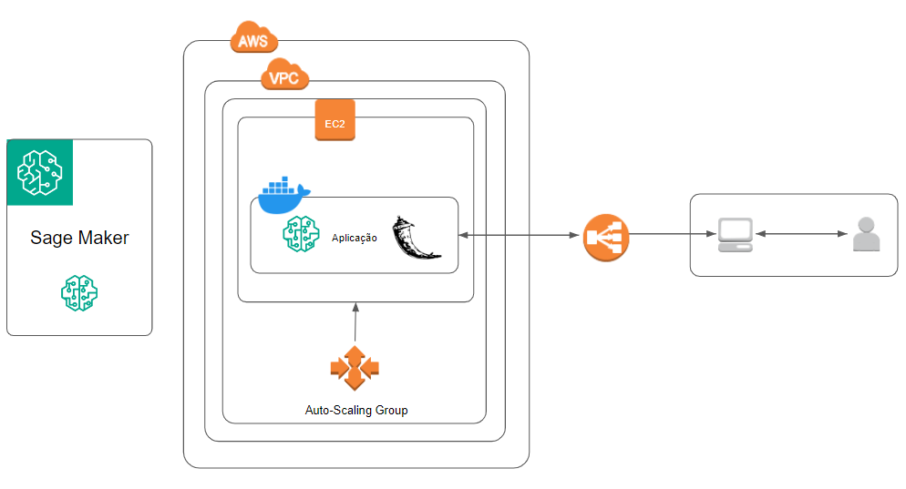

# Avaliação Sprint 5 - Programa de Bolsas Compass UOL / AWS e UFU

Avaliação da quinta sprint do programa de bolsas Compass UOL para formação em machine learning para AWS.

*******
## **Tabela de conteúdo**
  - [**Sobre o repositório**](#repositorio)
  - [**Execução do projeto Python Flask**](#execucao)
  - [**Criação dos containers**](#containers)
  - [**Projeto na AWS**](#aws)
  - [**Arquitetura do projeto**](#arquitetura)
  - [**Funcionamento**](#funcionamento)
  - [**Desenvolvimento da atividade**](#desenvolvimento)
  - [**Dificuldades**](#dificuldades)
  - [**Membros da equipe**](#membros)

*******

<div id="repositorio"/>

## **Sobre o repositório**

Este repositório possui uma solução para a quinta avaliação do curso machine learning para AWS da Compass UOL.  

O principal objetivo da aplicação é atribuir uma faixa de preço para uma determinada reserva de hotel utilizando o treinamento de uma base de dados com algorítimos de machine learning (XGBoost).  

A aplicação poderá retornar como resposta os valores 1, 2 ou 3, seguindo os critérios:  

```
1, se avg_price_per_room ≤ 85
2, se 85 < avg_price_per_room < 115
3, se avg_price_per_room ≥ 115
```

Foi utilizado para treino e classificação o algorítmo **XGboost** disponibilizado pelo container do SageMaker
  - A **acurácia** obtida foi de **81%**
  - O modelo binário xgboost salvo no S3 pelo SageMaker foi utilizado na API Flask

<div id= "execucao"/>

## **Execução do projeto Python Flask**

Para executar o projeto criado com o python, siga os passos abaixo:

1. Clone o repositório
2. Abra o terminal no diretório e realize o checkout para a branch `equipe-3`
3. Instale as dependências com o comando `pip install -r ./requirements.txt`
4. Execute o projeto node utilizando o comando `python ./main.py`
6. Abra `http://localhost:5000/` para acessar a rota raiz
7. Abra `http://localhost:5000/api/v1/predict` para acessar a rota api/v1/predict

>**Obs:** Verifique se a versão do Python instalada é igual ou superior a 3.11.3. Lembre-se de configurar as variáveis de ambiente.

<div id= "containers"/>

## **Criação dos containers**

Para criar os containers, digite os seguintes comandos:

``` Bash
docker build -t vcalixtor/sprint5-flaskapi:v0 .
```

Para executar os containers, deve-se digitar os seguintes comandos:

``` Bash
docker run --name sprint5_flaskapi --rm -d -p 5000:5000 vcalixtor/sprint5-flaskapi:v0
```

Uma vez que os containers se encontram em execução, basta acessar `http://localhost:5000` e a aplicação será exibida no navegador.

<div id= "aws"/>

## **Projeto na AWS**

- URL: http://g3-s5-flaskapi-env.eba-b2pwk2r2.us-east-1.elasticbeanstalk.com/
- Foi criado um domínio no SageMaker com o nome `s5-g3-compassuol` para a criação do notebook Jupyter com as etapas de pre-processamento, treino e validação do modelo
- Foi utilizado o container **XGBoost** que a AWS disponibiliza no SageMaker para treinamento  seguido pela previsão das classes propostas
- Foi criado um bucket S3 para o armazenamento de dados de teste treino e modelos com o nome de `uc-mlaws-sagemakerbucket` na pasta `compass-s5`
- Pontos relevantes de configuração para o deploy funcionar corretamente no Elastic Beanstalk:
  - Foi atribuído as tags propostas pela compass Name, Project e CostCenter
  - O código precisa ser compactado em .zip
  - Abaixo as políticas utilizadas na role aplicada ao Elastic Beanstalk:
    ```
        AmazonAppStreamFullAccess
        AWSElasticBeanstalkEnhancedHealth
        AWSElasticBeanstalkService
        AutoScalingFullAccess
    ```
  - Politicas das roles aplicadas às instâncias EC2 que o Elastic cria:
    ```
      AmazonEC2FullAccess
      AmazonEC2ContainerServiceforEC2Role
      AWSElasticBeanstalkWebTier
      AWSElasticBeanstalkWorkerTier
      AWSElasticBeanstalkMulticontainerDocker
      AutoScalingFullAccess
    ```
  - Foi utilizado instâncias T2 mikro
  - Foi utilizado o ambiente docker recomendado
  - O restante das informações seguem padrões

Para mais informações sobre as roles utilizadas consultar o link: https://docs.aws.amazon.com/elasticbeanstalk/latest/dg/iam-instanceprofile.html

<div id="arquitetura"/>
  
## **Arquitetura do projeto**

A arquitetura do projeto é mostrada na figura a seguir.



<div id= "funcionamento"/>

## **Funcionamento**

**1. Importando as bibliotecas necessárias:**

`Flask` para criar a aplicação web.  
`request` para lidar com as requisições HTTP recebidas pelo servidor.  
`XgboostPredictor` é uma classe que representa um modelo XGBoost para fazer previsões.

**2. Criando uma instância do modelo XGBoost:**

`xgboost_model = XgboostPredictor()` cria uma instância da classe `XgboostPredictor`, que contém o modelo treinado e os métodos para fazer as previsões.

**3. Criando a aplicação Flask:**

`app = Flask(__name__)` cria uma instância da aplicação Flask.

**4. Definindo as rotas:**

`@app.route('/')` define a rota raiz da aplicação.  
`@app.route('/api/v1/predict', methods=['POST'])` define a rota /api/v1/predict da aplicação.
* Essa rota aceita apenas requisições POST.
* A função post_prediction() recebe os dados da requisição usando request.get_json() e passa esses dados como argumento para o método predict() do modelo XGBoost.
* O resultado da previsão é retornado como uma resposta JSON.

**5. Executando o servidor:**

`app.run(host='0.0.0.0', port=5000)` inicia o servidor Flask na porta 5000 e faz com que ele esteja disponível para receber as requisições.
* Para testar, você pode enviar uma requisição POST para http://localhost:5000/api/v1/predict com os dados necessários para a previsão. Exemplo do corpo da requisição:
```
{
    "no_of_adults": "2",
    "no_of_children": "0",
    "no_of_weekend_nights": "0",
    "no_of_week_nights": "2",
    "type_of_meal_plan": "Meal Plan 1",
    "required_car_parking_space": "0",
    "room_type_reserved": "Room_Type 1",
    "lead_time": "72",
    "arrival_year": "2018",
    "arrival_month": "10",
    "arrival_date": "7",
    "market_segment_type": "Offline",
    "repeated_guest": "0",
    "no_of_previous_cancellations": "0",
    "no_of_previous_bookings_not_canceled": "0",
    "avg_price_per_room": "85.5",
    "no_of_special_requests": "0"
}
```
*  O resultado será retornado como uma resposta JSON. Exemplo:
 ```
{
    "result": 2
}
```
* Sobre o **input de dados**
  - Campos com valores numéricos devem ser enviados pelo usuário e são checados se existem e se são strings numéricas ou se são númericos, caso contrário, um erro será enviado
  - Campos categóricos são opcionais, caso o valor não seja enviado todos os seus dummies serão considerados 0

<div id= "desenvolvimento"/>

## **Desenvolvimento da atividade**

Inicialmente o repositório da sprint foi clonado e uma nova branch foi criada com o nome `equipe-3`.  
Após esta etapa, criamos o notebook no Amazon SageMaker:  

**1. Data Visualization and Preprocessing:**
   - Nesta etapa foi feita a análise dos dados, a identificação de quais dados seriam relevantes e o pré-processamento das informações.

**2. SageMaker Configuration:**
   - Nesta etapa foi feita a configuração do ambiente do Amazon SageMaker.

**3. Training:**
   - Nesta etapa, com os dados já pré-processados, foi realizado o treinamento do modelo com o XGBoost.

**4. Validation:**
   - Após o treinamento, foi feita a validação do desempenho do modelo e a atribuição de valores (1, 2 ou 3) para cada resultado, conforme os critérios citados [aqui](#repositorio).

**5. Database Export to JSON for Client-Side Testing:**
   - Nesta etapa os dados treinados foram exportados para o formato JSON para serem utilizados pelo cliente.


<div id= "dificuldades"/>

## **Dificuldades**

Não houveram dificuldades que impediram o desenvolvimento do projeto, porém algumas ocorrências devem ser destacadas:

- Foi testado uma rede neural que apresentou 72% de acurácia que foi substituída pelo xgboost por ter 81%. O desenvolvimento tomou um grande tempo da equipe
- Foi necessário algumas horas de estudo para o uso do modelo criado pelo XGboost da AWS no servidor Flask

<div id= "membros"/>

## **Membros da equipe**

- Ana Barbara Campos Conti
- Igor Blanco Toneti
- Guilherme Kameoka
- Vinicius Calixto Rocha
