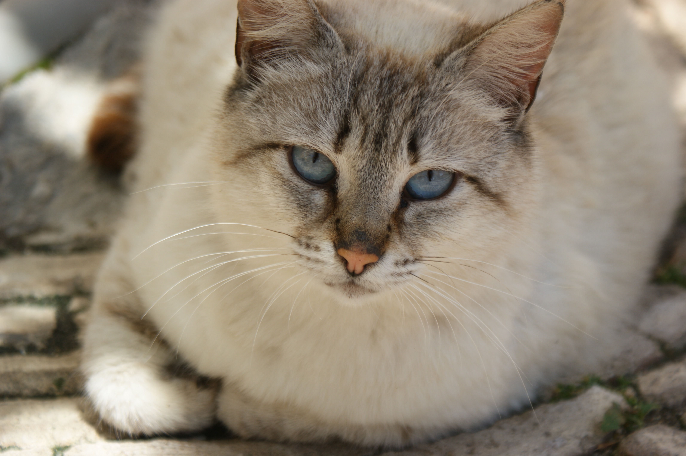
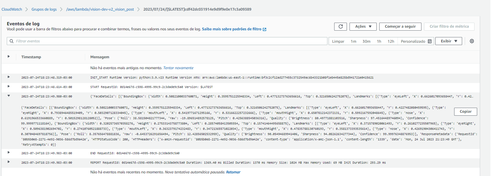

# Avaliação Sprint 8 - Programa de Bolsas Compass UOL / AWS e UFU

Avaliação da oitava sprint do programa de bolsas Compass UOL para formação em machine learning para AWS.

# Serverless e Rekognition   [](https://github.com/) [](https://aws.amazon.com/serverless/) [](https://aws.amazon.com/lambda/) [](https://aws.amazon.com/s3/) [](https://aws.amazon.com/rekognition/) 


Essa aplicação foi desenvolvida utilizando os conceitos de AWS Serverless, permitindo a criação de endpoints para executar funções Lambda que fazem consultas via API para o AWS Rekognition. A aplicação permite que os usuários enviem uma imagem que está em um bucket no Amazon S3 e, por meio de consultas feitas no endpoint, é capaz de enviar requisições HTTP em JSON para que as funções Lambda possam processar a imagem, são realizadas consultas ao AWS Rekognition, permitindo a identificação de objetos e a análise dos sentimentos presentes nas imagens das faces.


## Índice

- [Avaliação Sprint 8 - Programa de Bolsas Compass UOL / AWS e UFU](#avaliação-sprint-8---programa-de-bolsas-compass-uol--aws-e-ufu)
- [Serverless e Rekognition        ](#serverless-e-rekognition--------)
  - [Índice](#índice)
  - [Como utilizar](#como-utilizar)
    - [Usuario comum:](#usuario-comum)
    - [Desenvolvedor:](#desenvolvedor)
  - [Interagindo com a aplicação:](#interagindo-com-a-aplicação)
  - [Rota 4 -\> Post /v1/vision](#rota-4---post-v1vision)
  - [Rota 5 -\> Post /v2/vision](#rota-5---post-v2vision)
    - [Uma face](#uma-face)
    - [Duas faces](#duas-faces)
    - [Zero faces](#zero-faces)
  - [Tratamento de erros:](#tratamento-de-erros)
    - [Erro 500](#erro-500)
    - [Consultas CloudWatch](#consultas-cloudwatch)
  - [Arquitetura](#arquitetura)
  - [Desenvolvimento da atividade](#desenvolvimento-da-atividade)
  - [Dificuldades](#dificuldades)
  - [Fonte das Imagens](#fonte-das-imagens)
  - [Membros](#membros)

## Como utilizar

### Usuario comum:

Se você é um usuário comum e deseja apenas utilizar as funcionalidades da aplicação, basta acessar o link e inserir os Objetos JSON usando o Metódo POST.


>[Identificação de Objetos](https://oo7dzmhtfk.execute-api.us-east-1.amazonaws.com/v1/vision)

>[Análise de sentimentos em fotos](https://oo7dzmhtfk.execute-api.us-east-1.amazonaws.com/v2/vision)

### Desenvolvedor:

Para executar a aplicação em uma conta AWS, são necessários alguns passos. A seguir, apresentamos os passos para executar e configurar um serveless em uma conta AWS que utiliza o AWS Lambda."


```
**BUCKET**

1. Faça o download do repositório.
2. Crie uma conta na AWS.
3. Configure as credenciais
4. Entre no diretorio "visao-computacional"
5. Execute o comando: serveless deploy 
```
É esperado em seu terminal uma resposta do tipo: 
```
endpoints:

  GET - https://oo7dzmhtfk.execute-api.us-east-1.amazonaws.com/
  GET - https://oo7dzmhtfk.execute-api.us-east-1.amazonaws.com/v1
  GET - https://oo7dzmhtfk.execute-api.us-east-1.amazonaws.com/v2
  POST - https://oo7dzmhtfk.execute-api.us-east-1.amazonaws.com/v1/vision
  POST - https://oo7dzmhtfk.execute-api.us-east-1.amazonaws.com/v2/vision

functions:

  health: vision-dev-health (2.1 kB)
  v1Description: vision-dev-v1Description (2.1 kB)
  v2Description: vision-dev-v2Description (2.1 kB)
  v1_vision_post: vision-dev-v1_vision_post (2.1 kB)
  v2_vision_post: vision-dev-v2_vision_post (2.1 kB)
``` 
Neste ponto, temos as rotas GET padrão configuradas e as rotas do tipo POST, que são responsáveis por consultar o serviço Rekognition e realizar as análises. Os links são acessíveis e é por meio deles que você deve realizar suas consultas

## Interagindo com a aplicação:

## Rota 4 -> Post /v1/vision

É esperado que exista um bucket S3, onde o nome do bucket será passado como parâmetro em: `bucket`. Além disso, é necessário que haja uma imagem no bucket, cujo nome também será passado como parâmetro em: `imageName`.

<!--  -->


A rota `/v1/vision` receberá um método post no formato:


```json
{
  "bucket": "mycatphotos",
  "imageName": "cat.jpg"
}
```

- A imagem devará estar no S3
- Na sessão de erros voce pode visualizar como é a resposta da chamada da API no CloudWatch. 
- Dessa forma esse post deverá chamar o rekognition para nos entregar o seguinte retorno. 

Resposta a esperada é:

```json
{
   "url_to_image":"https://mycatphotosfabio/cats.jpg",
   "created_image":"24-07-2023 15:42:45",
   "labels":[
      {
         "Confidence":99.36764526367188,
         "Name":"Animal"
      },
      {
         "Confidence":99.36764526367188,
         "Name":"Cat"
      },
      {
         "Confidence":99.36764526367188,
         "Name":"Mammal"
      },
      {
         "Confidence":99.36764526367188,
         "Name":"Pet"
      },
      {
         "Confidence":93.9742202758789,
         "Name":"Abyssinian"
      },
      {
         "Confidence":84.85332489013672,
         "Name":"Siamese"
      },
      {
         "Confidence":57.943172454833984,
         "Name":"Manx"
      }
   ]
}
```
Os parametros retornados são:

- `url_to_image`: contém o endereço da imagem no bucket.
- `created_image`: representa a data de criação da imagem.
- `labels`: Os rótulos se referem às identificações feitas pelo serviço Rekognition na imagem.
- `Confidence`: A confiança é um valor numérico que indica o grau de certeza do algoritmo nas identificações dos rótulos.

<!-- Os rótulos fornecem informações sobre os objetos, cenas ou elementos presentes na imagem, enquanto a confiança indica o quão confiável é a precisão dessas identificações. -->

## Rota 5 -> Post /v2/vision

### Uma face 

Deverá ser criada a rota `/v2/vision` que receberá um post no formato abaixo:

```json
{
    "bucket": "mycatphotosfabio",
    "imageName": "attractive-1869761_1280.jpg"
}
```
É esperado que exista um bucket S3, onde o nome do bucket será passado como parâmetro em: `bucket`. Além disso, é necessário que haja uma imagem no bucket, cujo nome também será passado como parâmetro em: `imageName`.

Para a imagem a seguir, temos o seguinte exemplo: 
<!--  -->


É esperado uma resposta no seguinte formato:
```json
  {
  "url_to_image":"https://mycatphotosfabio/attractive-1869761_1280.jpg",
  "created_image":"26-07-2023 18:28:27",
  "faces":[
     {
        "position":{
           "Height":0.6807147264480591,
           "Left":0.3914523720741272,
           "Top":0.023707328364253044,
           "Width":0.2982746958732605
        },
        "classified_emotion":"CALM",
        "classified_emotion_confidence":96.91506958007812
     }
  ]
  }
```

Os parametros retornados são: 
- `url_to_image`: contém o endereço na imagem no bucket.
- `created_image`: é a data de criação da imagem. 
- `position` (posição): refere-se à posição da face em relação à imagem.
- `classified_emotion` (emoção classificada): indica a emoção que o serviço Rekognition foi capaz de identificar na imagem.
- `classified_emotion_confidence` (confiança na emoção classificada): representa a confiança que o serviço Rekognition tem na identificação daquela emoção em relação à imagem.


### Duas faces

<!--  -->


o Json é válido para a rota post

```json
{
    "bucket": "mycatphotosfabio",
    "imageName": "children-g1a48b8ea7_1280.jpg"
}
```

É esperado um retorno do tipo:

```json
{
  "url_to_image":"https://mycatphotosfabio/children-g1a48b8ea7_1280.jpg",
  "created_image":"26-07-2023 18:21:24",
  "faces":[
     {
        "position":{
           "Height":0.13045789301395416,
           "Left":0.5895359516143799,
           "Top":0.182535782456398,
           "Width":0.06976433098316193
        },
        "classified_emotion":"HAPPY",
        "classified_emotion_confidence":99.6654281616211
     },
     {
        "position":{
           "Height":0.11683471500873566,
           "Left":0.2998209297657013,
           "Top":0.241677924990654,
           "Width":0.06601109355688095
        },
        "classified_emotion":"HAPPY",
        "classified_emotion_confidence":73.47473907470703
     }
  ]
}
```

### Zero faces 

Um teste possível: 

```json
{
    "bucket": "mycatphotosfabio",
    "imageName": "image.jpeg"
}

```

 É esperado que exista um bucket S3, onde o nome do bucket será passado como parâmetro em: `bucket`. Além disso, é necessário que haja uma imagem no bucket, cujo nome também será passado como parâmetro em: `imageName`. Como podemos observar na figura a seguir temos uma imagem sem faces.

<!--  -->


A resposta Obtida é:
```json
{
   "url_to_image":"https://mycatphotosfabio/image.jpeg",
   "created_image":"26-07-2023 18:15:48",
   "faces":[
      {
         "position":{
            "Height":null,
            "Left":null,
            "Top":null,
            "Width":null
         },
         "classified_emotion":null,
         "classified_emotion_confidence":null
      }
   ]
}
```

## Tratamento de erros: 

Se houver qualquer tipo de erro, as respostas são esperadas: 

### Erro 500
Para qualquer tipo de excessão que aconteça, o erro esperado será um `Status: 500 Internal Server Error`. Para gerar o erro abaixo basta tentar analisar uma imagem que não existe no bucket.

```json
{"error": "Internal server error em post V2: An error occurred (InvalidS3ObjectException) when calling the DetectFaces operation: Unable to get object metadata from S3. Check object key, region and/or access permissions.{'bucket': 'mycatphotosfabio', 'imageName': 'attractive-1869761_1280.jg'}"}
```

### Consultas CloudWatch

Para a investigação de erros mais complexos e a realização de consultas ao AWS Rekognition, o serverless oferece a opção de visualização dos registros de consultas na API. Ao acessar o api-gateway, é possível visualizar os seguintes logs:

Para acessar: Entre em uma função lambda -> Acesse Monitor ->  CloudWatch Logs -> Selecione o documento que deseja visualizar -> Uma nova aba será aberta: 



## Arquitetura
A seguir está representada a arquitetura lógica dos recursos utilizados na AWS para desenvolver a atividade.


## Desenvolvimento da atividade

O desafio consiste em disponibilizar um endpoint para consultas ao AWS Rekognition. A escolha da linguagem Python foi feita devido à afinidade do grupo. A estrutura de pastas inclui o diretório 'visao-computacional', que contém toda a estrutura do serverless, como, por exemplo, o arquivo 'handler', que possui as funções que serão executadas, e o arquivo 'serverless', que possui as rotas dos endpoints. A pasta 's3-bucket-images' contém as imagens de teste para o programa. O objetivo do programa é retornar ao usuário a análise das imagens. No primeiro endpoint, o programa é capaz de realizar uma análise da imagem e retornar ao usuário uma descrição dos objetos encontrados na imagem. O segundo endpoint realiza uma análise das emoções baseada em imagens


## Dificuldades
- Permissões no AWS S3 e AWS Lambda: Encontrar a configuração correta das permissões no AWS S3 e AWS Lambda pode ser um desafio, pois envolve entender as políticas de acesso e garantir que as permissões sejam concedidas corretamente para os recursos e usuários relevantes.
- Familiarização com as novas tecnologias.
 
## Fonte das Imagens
Todas as imagens foram obtidas no seguinte site:

>[PIXABAY](https://pixabay.com/image)

## Membros

- Fabio Romero de Souza Junior
- Guilherme Rimoldi Kameoka 
- Victor José Teixeira da Silva 

