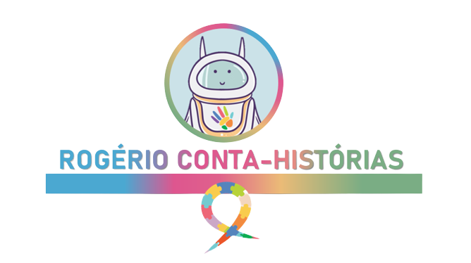
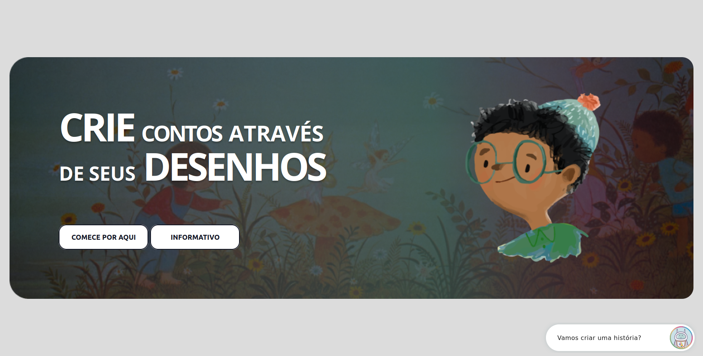
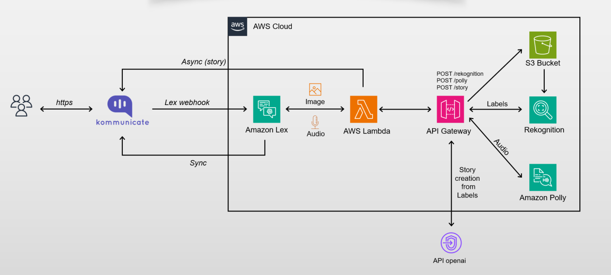

# Rogério Conta-Histórias

  

---

## Índice

- [Sobre este repositório](#sobre-este-repositório)
- [Como executar](#como-executar)
- [Front-end da aplicação](#front-end-da-aplicação)
- [Rotas da aplicação](#rotas-da-aplicação)
- [Diagrama de arquitetura](#diagrama-de-arquitetura)
- [Dificuldades](#dificuldades)
- [Membros da equipe](#membros-da-equipe)

## Sobre este repositório
     

Este repositório contém uma aplicação cujo objetivo é auxiliar crianças com autismo a desenvolverem suas capacidades cognitivas. A ideia é estimular a comunicação através de desenhos, que serão transformados em histórias lúdicas baseadas no conteúdo da ilustração. Dessa forma, pode-se trabalhar a criatividade e a imaginação e associá-las ao processo de educação da criança.

Para o desenvolvimento da aplicação serão utilizadas ferramentas da AWS, como Lex, Rekognition, Polly, Lambda, S3, dentre outras. Além disso, será utilizada a API da OpenAI. Esta ferramenta será a responsável por gerar a história baseada no desenho da criança.

## Como executar

Para executar a aplicação, siga os passos abaixo:

1. Clone o repositório do projeto.

2. Instale o framework [serverless](https://www.serverless.com/framework/docs/getting-started).

3. Acesse o diretório `src/serverless` (ver aquivo `serverless.yml`):

    - Em `enviroment` coloque os nomes dos buckets que serão utilizados para o Polly, para as imagens do bot e para o front-end.
    - Em `plugins` estão descritos os dois plugins necessários para a aplicação (`serverless-s3-sync` e `serverless-finch`).

4. Após inserir os nomes dos buckets e instalar os plugins, execute o comando `serverless deploy` para realizar o deploy da infraestrutura básica da aplicação.

5. Em seguida, acesse o diretório `src/bot_function` e configure as seguintes variáveis de ambiente:

    - Insira a chave `RAPID_API` para usar o Microsoft Translator.
    - Insira o link do bucket em `BUCKET_IMAGES`. Nele serão armazenadas as imagens enviadas pelos usuários do bot.
    - Não altere o valor da variável `ASYNC_FUNCTION_NAME`, pois já está configurada corretamente.
    - Em `INVOKE_URL` insira a URL do API GateWay informada no deploy do passo 4.
    - Insira a chave `KEY_API_KOM` para utilizar a ferramenta da Kommunicate.io de integração do bot com a página web.
    - Insira a chave `KEY_API_OPENAI` para utilizar a API da OpenAI e gerar as histórias a partir das labels do Rekognition.

6. Após configurar todas as variáveis de ambiente do passo 5, executar o comando `serverless deploy` para realizar o deploy da infraestrutura necessária para o bot.

7. Acesse o diretório `src/bot` e faça o upload do arquivo `project_autism-LexJson.zip` para o AWS Lex.

8. Configure o bot para utilizar a função lambda `botFunction-dev-botFuncion`. Dessa forma, todas as funcionalidades desenvolvidas serão utilizadas corretamente.

## Front-end da aplicação

O bot criado pela equipe foi integrado em uma página web, conforme mostrado nas Figuras de 1 a 3.

    
  Figura 1 - Página web da aplicação

Para realizar a integração do bot desenvolvido no Lex, utilizou-se a ferramenta da Kommunicate.io. Para mais detalhes sobre como realizar a integração, consulte a documentação da [Kommunicate](https://www.kommunicate.io/product/amazon-lex-integration).

Para testar a aplicação, acesse [Rogério Conta-História](http://front-end-sprint-9-10-grupo-2.s3-website-us-east-1.amazonaws.com/).

## Rotas da aplicação

A aplicação conta com as seguintes rotas:

- **Rota → Post/Rekognition**
    - Responsável por gerar os rótulos da imagem fornecida pelo usuário.

- **Rota → Post/Story**
    - Responsável por gerar a história baseada nas labels fornecidas pelo Rekognition.

- **Rota → Post/Polly**
    - Responsável por converter em áudio os textos devolvidos para o usuário.

## Diagrama de arquitetura

O diagrama de arquitetura da aplicação é mostrado na Figura 2.

    
  Figura 2 - Diagrama de arquitetura

## Dificuldades

As principais dificuldades encontradas pelo grupo foram:

- Criar o arquivo serverless para realizar o deploy de toda a infraestrutura da aplicação.
- Integrar a ferramenta corretamente com o Kommunicate.io (versão do idioma do bot).
- Entender de forma clara os requisitos solicitados pelo cliente.

## Membros da equipe

- Carlos Livius da Silva
- Guilherme Rimoldi Kameoka
- Igor Blanco Toneti
- Leandro Rodrigues de Avila
- Paulo Diego Silva Souza
- Pedro Henrique Resende Ribeiro
